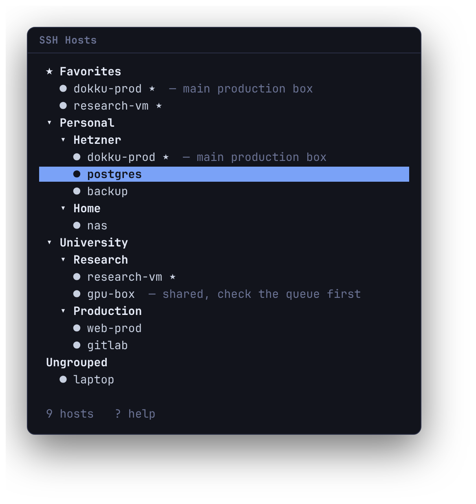

# herdr-hosts

A hierarchical SSH host picker for [Herdr](https://herdr.dev). Press a key, find
the host, press Enter — the session opens in its own tab, named after the host.



Folders, notes and all connection details come from `~/.ssh/config`. There is no
config file of its own, and **the plugin stores no credentials** — authentication
is left entirely to OpenSSH.

## Install

Requires Herdr ≥ 0.9.0 and OpenSSH. Linux and macOS.

```bash
herdr plugin install ecylmz/herdr-hosts
```

This downloads the binaries published with the matching release; if there is
none for your platform it builds from source, which needs a
[Rust toolchain](https://rustup.rs). Pin a revision with `--ref` if you want one.

<details>
<summary>From source, or for development</summary>

```bash
git clone https://github.com/ecylmz/herdr-hosts
cd herdr-hosts
cargo build --release
herdr plugin link "$PWD"
```

`plugin link` does not run build steps, so rebuild yourself after changing the
code. A linked plugin cannot be installed over — `herdr plugin unlink
herdr-hosts` first.

</details>

<details>
<summary>Prebuilt binaries by hand</summary>

Each [release](https://github.com/ecylmz/herdr-hosts/releases) carries
`herdr-hosts-<target>.tar.gz` for x86_64/aarch64 Linux and Apple Silicon/Intel
macOS. Unpack both binaries into `target/release/` inside a checkout, then
`herdr plugin link "$PWD"`.

</details>

Then try it:

```bash
herdr plugin action invoke herdr-hosts.open
```

and bind it to a free key in `~/.config/herdr/config.toml`, followed by
`herdr server reload-config`:

```toml
[[keys.command]]
key = "prefix+shift+s"
type = "plugin_action"
command = "herdr-hosts.open"
description = "SSH hosts"
```

Check the key is free first — `herdr --default-config` lists Herdr's own
bindings. `prefix+s` is settings and `prefix+h` is split_horizontal.

## Update

Herdr has no `plugin update`; reinstalling refreshes the managed checkout.

```bash
herdr plugin install ecylmz/herdr-hosts
```

Your favorites and plugin config are left in place. For a linked checkout,
`git pull && cargo build --release` instead.

Panes already running the old binary keep running it. Close any open picker or
session tab to pick up the new one.

## Uninstall

```bash
herdr plugin uninstall herdr-hosts   # or: herdr plugin unlink herdr-hosts
```

Favorites live in the plugin state directory and are not removed with it.
`~/.ssh/config` is never touched.

## Keys

```
↑ / k     previous               /  search (alias, folder, note)
↓ / j     next                   f  toggle favorite
→ / l     open folder, step in   r  reload ~/.ssh/config
← / h     close folder, step out ?  help
enter     connect, or return to an open session
shift+↵   always open a new tab for this host
space     expand / collapse      esc  leave search, then close
```

Enter on a host that already has a session switches to its tab rather than
opening a second one. When you do want two windows onto the same host, use
**shift+enter**. (That needs the kitty keyboard protocol, which Herdr supports;
elsewhere it behaves like plain Enter.)

## Organising hosts

OpenSSH has no concept of a group, so folders come from the comment headings
people already write:

```sshconfig
Host laptop

# --- Personal / Hetzner ---
Host dokku-prod   # main production box
Host postgres

# === University / Research ===
Host research-vm

Host *.internal
    User root
```

* **A heading** is a comment fenced by at least two of the same separator —
  `# --- Work ---`, `# === Work ===`, `# ** Work **`. `/` nests it. An ordinary
  comment like `# rotate this key` is *not* a heading, so an existing config
  keeps its meaning.
* **A heading runs until the next one.** Blank lines do not end a section, so
  hosts that should be ungrouped go above the first heading — `laptop` lands in
  `Ungrouped`, `research-vm` does not.
* **Notes** are trailing comments on the `Host` line. OpenSSH ignores everything
  after `#` there, so they cost nothing.
* **Patterns** like `Host *.internal` set defaults rather than name a host, so
  they are not listed.
* `Include` is followed, and relative paths resolve against `~/.ssh` — the same
  rule OpenSSH uses.

A config with no headings at all is simply one flat list, which is the right
default.

**Favorites** are the only thing the plugin writes, to its own state directory,
one alias per line. `~/.ssh/config` is never written to.

## How it works

Two binaries, declared in `herdr-plugin.toml`:

* `herdr-hosts` — the picker, opened as a **popup**, which leaves the tiled
  layout untouched and closes when the process exits.
* `herdr-hosts-ssh` — opened in its **own tab** with the alias in
  `HERDR_HOSTS_ALIAS`.

Herdr spawns plugin entrypoints as argv and the launcher runs `ssh <alias>` as
argv, so no shell is involved at any point and there is nothing for a hostile
alias to interpolate into. Aliases are also restricted to `[A-Za-z0-9._-]`.

Only `src/herdr.rs` talks to Herdr, so the rest is testable without a running
server: `cargo test`.

## Limitations

* No online/offline detection.
* Folders and notes are written in `~/.ssh/config`, not in the UI.
* No file watcher — press `r` after editing the config.
* Settings like `HostName` and `Port` are not resolved; ask OpenSSH instead
  (`ssh -G <alias>`).
* A persistent docked sidebar is not implemented; the picker is a popup.

## License

MIT.
